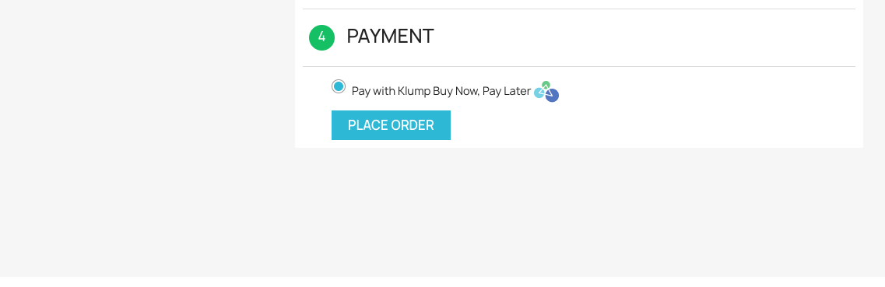

Welcome to Klump's Plugin for PrestaShop.

### Installation.
Kindly download the latest version of the plugin from the following link - [PrestaShop Plugin](https://github.com/Klump-Inc/prestashop-plugin/archive/refs/heads/master.zip). When you have downloaded the zip file, please follow the instructions below to install the plugin:

1. Go to the admin panel of your PrestaShop site.
2. Go to the "Modules" section and click on "Module Manager".
3. Click on the "Upload a module" button. The button is located at the top right corner of the page. 
4. When the dialog box appears, select the plugin zipped folder that you downloaded earlier and the plugin will be installed.
5. Once the plugin is installed, you can go to the "Modules" section and search for "Klump" to configure the plugin.
6. When you find the module, click on the "Configure" button.

### Configuration.
For you to configure the plugin, please follow the instructions below:
1. Go to your Klump's [merchant dashboard](https://merchant.useklump.com).
2. Under the "Settings" tab, click on the "API Keys" section.
3. Copy the "API Key" and paste it in the "API Key" field in the plugin configuration. Do this for both Test and Live environments.
4. Save the configuration.

Search Plugin

Configure Plugin

### Testing
To test the plugin, please follow the instructions below:
1. Go to your PrestaShop site and add a product to your cart.
2. Go to the checkout page and enter your shipping address.
3. Select Klump as your payment method.
4. Check the Klump documentation for sample test credetials to use - [klump documentation](https://docs.useklump.com/docs/test-cards)

If you have any questions, please contact us at engineering@klump.com or Join on Slack Channel.

### Contributing to the project
To contribute, clone the project and branch off `release/develop` and create a new branch off of that. The project requires Docker and [Docker Compose](https://docker.com) to be installed.

To run the project locally, simply run `make run_with_logs` from your terminal in the project directory.